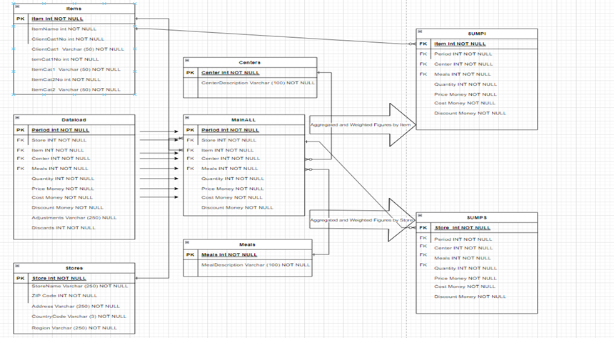

# Assignment: Translating RDBMS Schema to Cassandra Schema Using Query First Design Approach

## Team Alpha - X
### Members:
* Cristobal Banda
* Jose Bauza
* Silvia Castro
* Lee Noel

## Objectives

- Understand the fundamental differences between RDBMS and Apache Cassandra.
- Apply the "Query First" design approach to schema design in Cassandra.
- Develop proficiency in Markdown for technical documentation.

## Introduction

In this project we will be taking a live RDBMS and converting to a Query First design approach design in Casandra. The meta data is based on the hospitality industry. Data is collected from multiple centers defined as customers who order In-Store, through the Drive Through, or have it delivered using Delivery method. For our queries, we assume that some of our Cassandra tables will stand alone and not be used to derive other queries/tables. We would like to explore the delivery of the same analysis delivered from a RDBMS and how that could be supported using Casandra as compared to staying with a RDBMS. By understanding the key differences in designs, the tables in Casandra will be designed to meet client needs while maintaining a performant structure that will comply will the level of auditing and data integrity necessary to comply with regulations.  

## Analyze the RDBMS Schema

*The RDBMS ERD Schema is completed.*



## Design Cassandra Schema

*Here, we would document the design process and the final Cassandra table designs, including partition keys, clustering columns, and any secondary indexes.*

# Schema SQL

```sql
Create KEYSPACE store
    WITH REPLICATION = {'class': 'SimpleStrategy', 'replication_factor': 3};

CREATE TABLE store.total_sales (
    period int,
    store int,
    item int,
    center int,
    quantity int,
    price float,
    cost float,
    sales float,
    PRIMARY KEY ((period), store, item, center)
) WITH comment = 'Q1.Total sales by period, store, item, and center';

CREATE TABLE store.store_sales (
    store int,
    period int,
    center int,
    region text,
    price float,
    quantity int,
    cost float,
    sales float,
    PRIMARY KEY ((store), period, center, region)
)WITH comment = 'Q2. Store sales by period, center, and region';

CREATE TABLE store.high_perform_item_cat (
    item int,
    period int,
    center int,
    category text,
    sales float,
    PRIMARY KEY ((item), period, center, category, sales) ## sales is added to clustering key for sorting
)WITH comment = 'Q3. High performing items by category'
AND CLUSTERING ORDER BY (sales DESC);

CREATE TABLE store.low_perform_item_cat (
    item int,
    period int,
    center int,
    category text,
    sales float,
    PRIMARY KEY ((item), period, center, category, sales) ## sales is added to clustering key for sorting
)WITH comment = 'Q4. Low performing items by category'
AND CLUSTERING ORDER BY (sales ASC);

CREATE TABLE store.top_regions_per_capita (
    region text,
    period int,
    price float,
    sales_per_capita float,
    cost float,
    quantity int,
    PRIMARY KEY ((region), period, sales) ## sales is added to clustering key for sorting
) WITH comment = 'Q5. Top regions by sales per capita'
AND CLUSTERING ORDER BY (sales DESC);

CREATE TABLE store.bottom_regions_per_capita (
    region text,
    period int,
    price float,
    sales_per_capita float,
    cost float,
    quantity int,
    PRIMARY KEY ((region), period, sales) ## sales is added to clustering key for sorting
) WITH comment = 'Q6. Top regions by sales per capita'
AND CLUSTERING ORDER BY (sales ASC);

CREATE TABLE store.store_profit_margin (
    store int,
    period int,
    cost float,
    sales float,
    profit float,
    PRIMARY KEY ((store), period)
) WITH comment = 'Q7. Store profit margin by period';

CREATE TABLE store.item_demand (
    item int,
    period int,
    center int,
    quantity int,
    PRIMARY KEY ((item), period, center)
) WITH comment = 'Q8. Item demand by period and center';
```

## Query Analysis

The queries below are numbered with the group member initial (e.g., Q1c is Cris’s first query):

- Q1c) Item Sales Order by revenue center
- Q2c) Store Sales Order by revenue center
- Q1s) High-performing Item Category per revenue center in terms of revenue
- Q2s) Underperforming Item Category per revenue center in terms of revenue
- Q1j) Top performing regions per capita
- Q2j) Worst performing regions per capita
- Q1l) Check demand levels (quantity) of specified items in each revenue center.
- Q2l) Calculating profit margin for each store after accounting for the cost.

## Queries SQL

```sql
SELECT * FROM store.regions_by_sales_per_capita
WHERE period >= '2024-01-01'  
ORDER BY sales_per_capita DESC
LIMIT 5;

SELECT * FROM store.total_sales
WHERE period >= '2024-01-01'  
ORDER BY sales DESC
LIMIT 5;

SELECT * FROM store.high_perform_item_cat
WHERE 	period >= '2024-01-01' 
    AND center in (1,2,3) -- Instore, DriveThru, Delivery
  AND category in ('ALC','Entree','Combo','Deserts') 
  ORDER BY sales DESC
LIMIT 1;
```

## Discussion

### Challenges and Trade-offs

A challenge we encountered was restructuring the model of our data to fit Cassandra’s model in comparison to the RDBMS model our data is most suited for. For example, many tables in our database share a relationship with each other and due to Cassandra’s limitations on joining tables together, we had to denormalize some of our tables and create redundancies to fit this model. 

An additional factor our team had to keep in mind when approaching the translation process was understanding the business questions we wanted our queries to answer, which would then determine which tables and fields would need to be migrated over to Cassandra. This approach required careful and intentional consideration about what tables would have to go into our model. That said, the Cassandra architecture would be best suited in scenarios where the analysis that needs to be performed is more direct rather than exploratory. On the other hand, an RDBMS approach would allow for all data to be stored in one place regardless of its current use, thus being able to create more flexible queries as more insights are uncovered. 

## Conclusion

**Learning Outcomes:** To create or migrate a database to Cassandra, one must first understand the questions you are trying to answer via your model prior to building it. The data model then needs to be reconstructed to fit the Cassandra architecture by taking into consideration the queries, which would then determine the schema design. This is different from a relational database whose design is determined by the relationship between the entities.

**Potential Real-world Implications:** Using a Cassandra architecture could come with some drawbacks. For example, any updates that need to be made to the dataset would consume a large number of resources and time that may outweigh the benefits of this design choice, increasing the cost of maintaining this database. Additionally, Cassandra also comes with its limitations on data analysis. The databases’ query language – CQL – does not easily support features that are critical for many use cases, such as joins and advanced aggregations. If there is a future need for these features, this design choice would add an additional layer of complexity that does not exist within a relational database model.